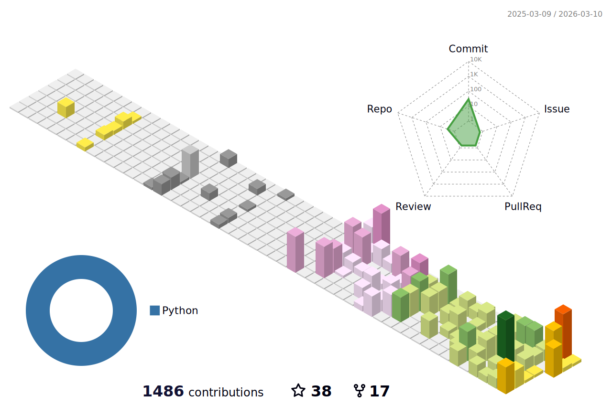

<h1 align="center"><code>> osw4l</code></h1>

<b>Senior Backend Engineer · AI Systems · Tech Lead · 11+ years</b>

  
  
  
  

---

## `~/whoami`

  <picture>
    <source media="(prefers-color-scheme: dark)" srcset="./output.gif" />
    <source media="(prefers-color-scheme: light)" srcset="./output.gif" />
    
  </picture>

---

## `~/stats --metrics`

  <picture>
    <source media="(prefers-color-scheme: dark)" srcset="https://github-readme-stats.vercel.app/api?username=osw4l&show_icons=true&theme=tokyonight&hide_border=true&bg_color=0d1117&title_color=b967ff&icon_color=01cdfe&text_color=c9d1d9&ring_color=ff71ce&include_all_commits=true&count_private=true" />
    <source media="(prefers-color-scheme: light)" srcset="https://github-readme-stats.vercel.app/api?username=osw4l&show_icons=true&theme=default&hide_border=true&include_all_commits=true&count_private=true" />
    
  </picture>
  <picture>
    <source media="(prefers-color-scheme: dark)" srcset="https://streak-stats.demolab.com?user=osw4l&theme=tokyonight&hide_border=true&background=0d1117&ring=ff71ce&fire=01cdfe&currStreakLabel=b967ff&sideLabels=b967ff&dates=c9d1d9" />
    <source media="(prefers-color-scheme: light)" srcset="https://streak-stats.demolab.com?user=osw4l&theme=default&hide_border=true" />
    
  </picture>

  <picture>
    <source media="(prefers-color-scheme: dark)" srcset="https://github-readme-stats.vercel.app/api/top-langs/?username=osw4l&layout=compact&theme=tokyonight&hide_border=true&bg_color=0d1117&title_color=b967ff&text_color=c9d1d9&langs_count=10&count_private=true" />
    <source media="(prefers-color-scheme: light)" srcset="https://github-readme-stats.vercel.app/api/top-langs/?username=osw4l&layout=compact&theme=default&hide_border=true&langs_count=10&count_private=true" />
    
  </picture>
  <picture>
    <source media="(prefers-color-scheme: dark)" srcset="https://github-readme-activity-graph.vercel.app/graph?username=osw4l&bg_color=0d1117&color=b967ff&line=01cdfe&point=ff71ce&area_color=1a1b3a&area=true&hide_border=true" />
    <source media="(prefers-color-scheme: light)" srcset="https://github-readme-activity-graph.vercel.app/graph?username=osw4l&theme=github-compact&hide_border=true&area=true" />
    
  </picture>

---

## `~/stack --weapons`

#### Languages

#### Frameworks

#### Databases & Messaging

#### Cloud & DevOps

#### AI / Agentic

---

## `~/contrib --3d-season`

  <picture>
    <source media="(prefers-color-scheme: dark)" srcset="./profile-3d-contrib/profile-south-season-animate.svg" />
    <source media="(prefers-color-scheme: light)" srcset="./profile-3d-contrib/profile-south-season-animate.svg" />
    
  </picture>

---

## `~/projects --pinned`

| Repo | Description | Stack |
|------|-------------|-------|
| [django-docker-full](https://github.com/osw4l/django-docker-full) | Django + Docker full setup |   |
| [real-state-api](https://github.com/osw4l/real-state-api) | Real estate REST API |   |
| [beer-tap-dispenser-api](https://github.com/osw4l/beer-tap-dispenser-api) | Beer tap dispenser service |   |
| [django-tickets-api](https://github.com/osw4l/django-tickets-api) | Ticket management API |   |

---

  
  
  

