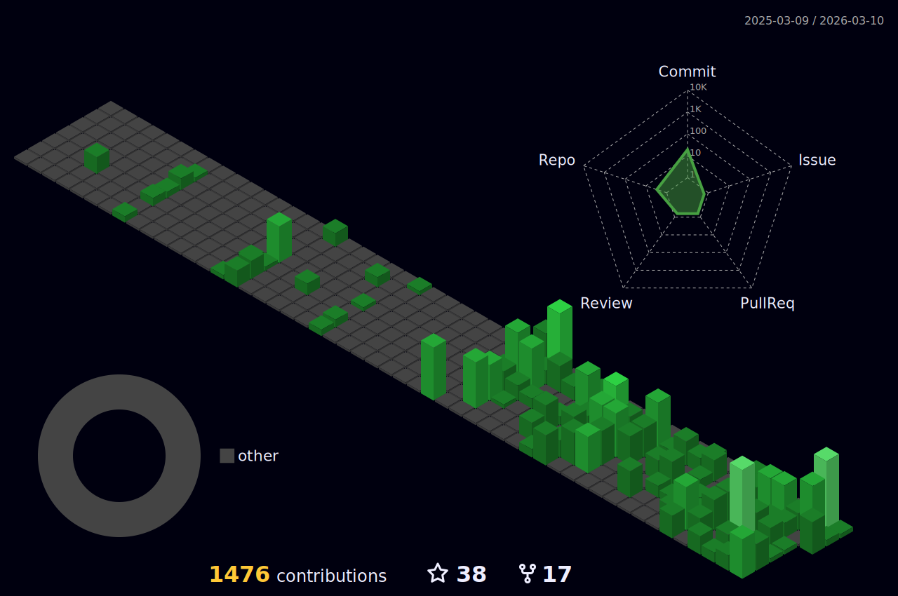

<div align="center">

<picture>
  <source media="(prefers-color-scheme: dark)" srcset="https://capsule-render.vercel.app/api?type=venom&color=0:000000,50:003300,100:00ff41&height=220&section=header&text=Oswaldo%20Rodriguez&fontSize=52&fontColor=00ff41&fontAlignY=38&desc=%3E_%20Senior%20Backend%20Engineer%20%7C%20AI%20Systems%20%7C%20Tech%20Lead&descAlignY=58&descSize=17&animation=fadeIn" />
  <source media="(prefers-color-scheme: light)" srcset="https://capsule-render.vercel.app/api?type=waving&color=0:0f2027,50:203a43,100:2c5364&height=220&section=header&text=Oswaldo%20Rodriguez&fontSize=52&fontColor=ffffff&fontAlignY=38&desc=Senior%20Backend%20Engineer%20%7C%20AI%20Systems%20%7C%20Tech%20Lead&descAlignY=58&descSize=17&animation=fadeIn" />
  
</picture>

<br/>

<picture>
  <source media="(prefers-color-scheme: dark)" srcset="https://readme-typing-svg.demolab.com?font=Fira+Code&weight=600&size=20&duration=2500&pause=800&color=00FF41&background=00000000&center=true&vCenter=true&width=750&lines=%3E+initializing+profile...+%5B+DONE+%5D;%3E+loading+stack%3A+Python+%7C+Go+%7C+FastAPI+%7C+Django;%3E+ai_stack%3A+LangChain+%7C+LangGraph+%7C+RAG+%7C+MCP;%3E+cloud%3A+AWS+%7C+GCP+%7C+Kubernetes+%7C+Terraform;%3E+experience%3A+11+years+%5B+OK+%5D;%3E+status%3A+OPEN+TO+REMOTE+%5B+READY+%5D" />
  <source media="(prefers-color-scheme: light)" srcset="https://readme-typing-svg.demolab.com?font=Fira+Code&weight=600&size=20&duration=2500&pause=800&color=0f2027&background=00000000&center=true&vCenter=true&width=750&lines=%3E+initializing+profile...+%5B+DONE+%5D;%3E+loading+stack%3A+Python+%7C+Go+%7C+FastAPI+%7C+Django;%3E+ai_stack%3A+LangChain+%7C+LangGraph+%7C+RAG+%7C+MCP;%3E+cloud%3A+AWS+%7C+GCP+%7C+Kubernetes+%7C+Terraform;%3E+experience%3A+11+years+%5B+OK+%5D;%3E+status%3A+OPEN+TO+REMOTE+%5B+READY+%5D" />
  
</picture>

<br/>

[](https://linkedin.com/in/osw4l)
[](mailto:ioswxd@gmail.com)
[](https://github.com/osw4l)
[](https://github.com/osw4l)

</div>

---

<picture>
  <source media="(prefers-color-scheme: dark)" srcset="https://github-readme-stats.vercel.app/api/top-langs/?username=osw4l&layout=compact&theme=chartreuse-dark&hide_border=true&langs_count=6&card_width=280" />
  <source media="(prefers-color-scheme: light)" srcset="https://github-readme-stats.vercel.app/api/top-langs/?username=osw4l&layout=compact&theme=default&hide_border=true&langs_count=6&card_width=280" />
  
</picture>

### `~/whoami`

```bash
$ cat profile.json
{
  "name":       "Oswaldo Rodriguez",
  "role":       "Senior Backend Engineer & Tech Lead",
  "location":   "Barcelona, Spain",
  "experience": "11+ years",
  "current": {
    "company":  "Capytop LLC",
    "project":  "FlickFlow — Trading SaaS (TradingLab)",
    "role":     "Director of Engineering"
  },
  "stack":    ["Python","Go","FastAPI","Django",
               "LangChain","LangGraph","RAG","AWS","GCP"],
  "clients":  ["EPAM x SLB","Globant x Everfi",
               "Stocktwits","Rappi","Code & Theory"],
  "open_to":  "Remote · Senior/Staff Backend · AI Engineering"
}
```

<br clear="right"/>

---

## `~/stack --list`

**Languages**

<div align="left">
  <picture>
    <source media="(prefers-color-scheme: dark)" srcset="https://iconic-api.onrender.com/dark/python" />
    <source media="(prefers-color-scheme: light)" srcset="https://iconic-api.onrender.com/light/python" />
    
  </picture>
  &nbsp;
  <picture>
    <source media="(prefers-color-scheme: dark)" srcset="https://iconic-api.onrender.com/dark/golang" />
    <source media="(prefers-color-scheme: light)" srcset="https://iconic-api.onrender.com/light/golang" />
    
  </picture>
  &nbsp;
  <picture>
    <source media="(prefers-color-scheme: dark)" srcset="https://iconic-api.onrender.com/dark/elixir" />
    <source media="(prefers-color-scheme: light)" srcset="https://iconic-api.onrender.com/light/elixir" />
    
  </picture>
  &nbsp;
  <picture>
    <source media="(prefers-color-scheme: dark)" srcset="https://iconic-api.onrender.com/dark/rust" />
    <source media="(prefers-color-scheme: light)" srcset="https://iconic-api.onrender.com/light/rust" />
    
  </picture>
</div>

<br/>

**Backend Frameworks**

<div align="left">
  <picture>
    <source media="(prefers-color-scheme: dark)" srcset="https://iconic-api.onrender.com/dark/fastapi" />
    <source media="(prefers-color-scheme: light)" srcset="https://iconic-api.onrender.com/light/fastapi" />
    
  </picture>
  &nbsp;
  <picture>
    <source media="(prefers-color-scheme: dark)" srcset="https://iconic-api.onrender.com/dark/django" />
    <source media="(prefers-color-scheme: light)" srcset="https://iconic-api.onrender.com/light/django" />
    
  </picture>
  &nbsp;
  <picture>
    <source media="(prefers-color-scheme: dark)" srcset="https://iconic-api.onrender.com/dark/flask" />
    <source media="(prefers-color-scheme: light)" srcset="https://iconic-api.onrender.com/light/flask" />
    
  </picture>
</div>

<br/>

**Databases**

<div align="left">
  <picture>
    <source media="(prefers-color-scheme: dark)" srcset="https://iconic-api.onrender.com/dark/postgresql" />
    <source media="(prefers-color-scheme: light)" srcset="https://iconic-api.onrender.com/light/postgresql" />
    
  </picture>
  &nbsp;
  <picture>
    <source media="(prefers-color-scheme: dark)" srcset="https://iconic-api.onrender.com/dark/redis" />
    <source media="(prefers-color-scheme: light)" srcset="https://iconic-api.onrender.com/light/redis" />
    
  </picture>
  &nbsp;
  <picture>
    <source media="(prefers-color-scheme: dark)" srcset="https://iconic-api.onrender.com/dark/mongodb" />
    <source media="(prefers-color-scheme: light)" srcset="https://iconic-api.onrender.com/light/mongodb" />
    
  </picture>
  &nbsp;
  <picture>
    <source media="(prefers-color-scheme: dark)" srcset="https://iconic-api.onrender.com/dark/elasticsearch" />
    <source media="(prefers-color-scheme: light)" srcset="https://iconic-api.onrender.com/light/elasticsearch" />
    
  </picture>
  &nbsp;
  <picture>
    <source media="(prefers-color-scheme: dark)" srcset="https://iconic-api.onrender.com/dark/firebase" />
    <source media="(prefers-color-scheme: light)" srcset="https://iconic-api.onrender.com/light/firebase" />
    
  </picture>
</div>

<br/>

**Cloud & DevOps**

<div align="left">
  <picture>
    <source media="(prefers-color-scheme: dark)" srcset="https://iconic-api.onrender.com/dark/aws" />
    <source media="(prefers-color-scheme: light)" srcset="https://iconic-api.onrender.com/light/aws" />
    
  </picture>
  &nbsp;
  <picture>
    <source media="(prefers-color-scheme: dark)" srcset="https://iconic-api.onrender.com/dark/gcp" />
    <source media="(prefers-color-scheme: light)" srcset="https://iconic-api.onrender.com/light/gcp" />
    
  </picture>
  &nbsp;
  <picture>
    <source media="(prefers-color-scheme: dark)" srcset="https://iconic-api.onrender.com/dark/docker" />
    <source media="(prefers-color-scheme: light)" srcset="https://iconic-api.onrender.com/light/docker" />
    
  </picture>
  &nbsp;
  <picture>
    <source media="(prefers-color-scheme: dark)" srcset="https://iconic-api.onrender.com/dark/kubernetes" />
    <source media="(prefers-color-scheme: light)" srcset="https://iconic-api.onrender.com/light/kubernetes" />
    
  </picture>
  &nbsp;
  <picture>
    <source media="(prefers-color-scheme: dark)" srcset="https://iconic-api.onrender.com/dark/terraform" />
    <source media="(prefers-color-scheme: light)" srcset="https://iconic-api.onrender.com/light/terraform" />
    
  </picture>
</div>

<br/>

**AI / Agentic Stack**


---

## `~/git stats`

<div align="center">

<picture>
  <source media="(prefers-color-scheme: dark)" srcset="https://github-readme-stats.vercel.app/api?username=osw4l&show_icons=true&theme=chartreuse-dark&hide_border=true&count_private=true&include_all_commits=true" />
  <source media="(prefers-color-scheme: light)" srcset="https://github-readme-stats.vercel.app/api?username=osw4l&show_icons=true&theme=default&hide_border=true&count_private=true&include_all_commits=true" />
  
</picture>
&nbsp;&nbsp;
<picture>
  <source media="(prefers-color-scheme: dark)" srcset="https://github-readme-streak-stats.herokuapp.com/?user=osw4l&theme=chartreuse-dark&hide_border=true" />
  <source media="(prefers-color-scheme: light)" srcset="https://github-readme-streak-stats.herokuapp.com/?user=osw4l&theme=default&hide_border=true" />
  
</picture>

</div>

---

## `~/achievements --display`

<div align="center">
  <picture>
    <source media="(prefers-color-scheme: dark)" srcset="https://github-profile-trophy.vercel.app/?username=osw4l&theme=matrix&no-frame=true&margin-w=8&row=1&column=7" />
    <source media="(prefers-color-scheme: light)" srcset="https://github-profile-trophy.vercel.app/?username=osw4l&theme=flat&no-frame=true&margin-w=8&row=1&column=7" />
    
  </picture>
</div>

---

## `~/contrib --3d`

<div align="center">
  <picture>
    <source media="(prefers-color-scheme: dark)" srcset="./profile-3d-contrib/profile-night-green.svg" />
    <source media="(prefers-color-scheme: light)" srcset="./profile-3d-contrib/profile-gitblock.svg" />
    
  </picture>
</div>

<details>
<summary><code>⚙️ setup 3D graph → click to expand</code></summary>

Create `.github/workflows/profile-3d.yml`:

```yaml
name: GitHub-Profile-3D-Contrib
on:
  schedule:
    - cron: "0 18 * * *"
  workflow_dispatch:
  push:
    branches: [main]
jobs:
  build:
    runs-on: ubuntu-latest
    steps:
      - uses: actions/checkout@v3
      - uses: yoshi389111/github-profile-3d-contrib@0.7.1
        env:
          GITHUB_TOKEN: ${{ secrets.GITHUB_TOKEN }}
          USERNAME: ${{ github.repository_owner }}
          SETTING_JSON: '{"contributionColorArray":["#003300","#005500","#007700","#00aa00","#00ff41"]}'
      - run: |
          git config user.email "action@github.com"
          git config user.name "GitHub Action"
          git add -A .
          git commit -m "chore: update 3d contrib" || exit 0
          git push
```

Go to **Actions → Run workflow** to generate the first time.
The action generates multiple SVG variants — both `profile-night-green.svg` (dark) and `profile-gitblock.svg` (light) will be created automatically.

</details>

---

## `~/contrib --activity`

<div align="center">
  <picture>
    <source media="(prefers-color-scheme: dark)" srcset="https://github-readme-activity-graph.vercel.app/graph?username=osw4l&theme=high-contrast&hide_border=true&area=true&area_color=003300&color=00ff41&line=00cc33&point=00ff41&bg_color=000000" />
    <source media="(prefers-color-scheme: light)" srcset="https://github-readme-activity-graph.vercel.app/graph?username=osw4l&theme=github-compact&hide_border=true&area=true" />
    
  </picture>
</div>

---

## `~/contrib --summary`

<div align="center">

<picture>
  <source media="(prefers-color-scheme: dark)" srcset="https://github-profile-summary-cards.vercel.app/api/cards/profile-details?username=osw4l&theme=github_dark" />
  <source media="(prefers-color-scheme: light)" srcset="https://github-profile-summary-cards.vercel.app/api/cards/profile-details?username=osw4l&theme=github" />
  
</picture>

<br/>

<picture>
  <source media="(prefers-color-scheme: dark)" srcset="https://github-profile-summary-cards.vercel.app/api/cards/repos-per-language?username=osw4l&theme=github_dark" />
  <source media="(prefers-color-scheme: light)" srcset="https://github-profile-summary-cards.vercel.app/api/cards/repos-per-language?username=osw4l&theme=github" />
  
</picture>
&nbsp;
<picture>
  <source media="(prefers-color-scheme: dark)" srcset="https://github-profile-summary-cards.vercel.app/api/cards/most-commit-language?username=osw4l&theme=github_dark" />
  <source media="(prefers-color-scheme: light)" srcset="https://github-profile-summary-cards.vercel.app/api/cards/most-commit-language?username=osw4l&theme=github" />
  
</picture>
&nbsp;
<picture>
  <source media="(prefers-color-scheme: dark)" srcset="https://github-profile-summary-cards.vercel.app/api/cards/productive-time?username=osw4l&theme=github_dark&utcOffset=1" />
  <source media="(prefers-color-scheme: light)" srcset="https://github-profile-summary-cards.vercel.app/api/cards/productive-time?username=osw4l&theme=github&utcOffset=1" />
  
</picture>

</div>

---

## `~/projects --pinned`

<div align="center">

<picture>
  <source media="(prefers-color-scheme: dark)" srcset="https://github-readme-stats.vercel.app/api/pin/?username=osw4l&repo=django-docker-full&theme=chartreuse-dark&hide_border=true" />
  <source media="(prefers-color-scheme: light)" srcset="https://github-readme-stats.vercel.app/api/pin/?username=osw4l&repo=django-docker-full&theme=default&hide_border=true" />
  
</picture>
&nbsp;
<picture>
  <source media="(prefers-color-scheme: dark)" srcset="https://github-readme-stats.vercel.app/api/pin/?username=osw4l&repo=real-state-api&theme=chartreuse-dark&hide_border=true" />
  <source media="(prefers-color-scheme: light)" srcset="https://github-readme-stats.vercel.app/api/pin/?username=osw4l&repo=real-state-api&theme=default&hide_border=true" />
  
</picture>

<picture>
  <source media="(prefers-color-scheme: dark)" srcset="https://github-readme-stats.vercel.app/api/pin/?username=osw4l&repo=beer-tap-dispenser-api&theme=chartreuse-dark&hide_border=true" />
  <source media="(prefers-color-scheme: light)" srcset="https://github-readme-stats.vercel.app/api/pin/?username=osw4l&repo=beer-tap-dispenser-api&theme=default&hide_border=true" />
  
</picture>
&nbsp;
<picture>
  <source media="(prefers-color-scheme: dark)" srcset="https://github-readme-stats.vercel.app/api/pin/?username=osw4l&repo=django-tickets-api&theme=chartreuse-dark&hide_border=true" />
  <source media="(prefers-color-scheme: light)" srcset="https://github-readme-stats.vercel.app/api/pin/?username=osw4l&repo=django-tickets-api&theme=default&hide_border=true" />
  
</picture>

</div>

---

<div align="center">

`> ping osw4l --connect`

[](https://linkedin.com/in/osw4l)
[](mailto:ioswxd@gmail.com)
[](https://github.com/osw4l)

`🎹 also a piano player  |  🌍 open to remote`

<picture>
  <source media="(prefers-color-scheme: dark)" srcset="https://capsule-render.vercel.app/api?type=venom&color=0:00ff41,50:003300,100:000000&height=120&section=footer&reversal=true" />
  <source media="(prefers-color-scheme: light)" srcset="https://capsule-render.vercel.app/api?type=waving&color=0:2c5364,50:203a43,100:0f2027&height=120&section=footer" />
  
</picture>

</div>
