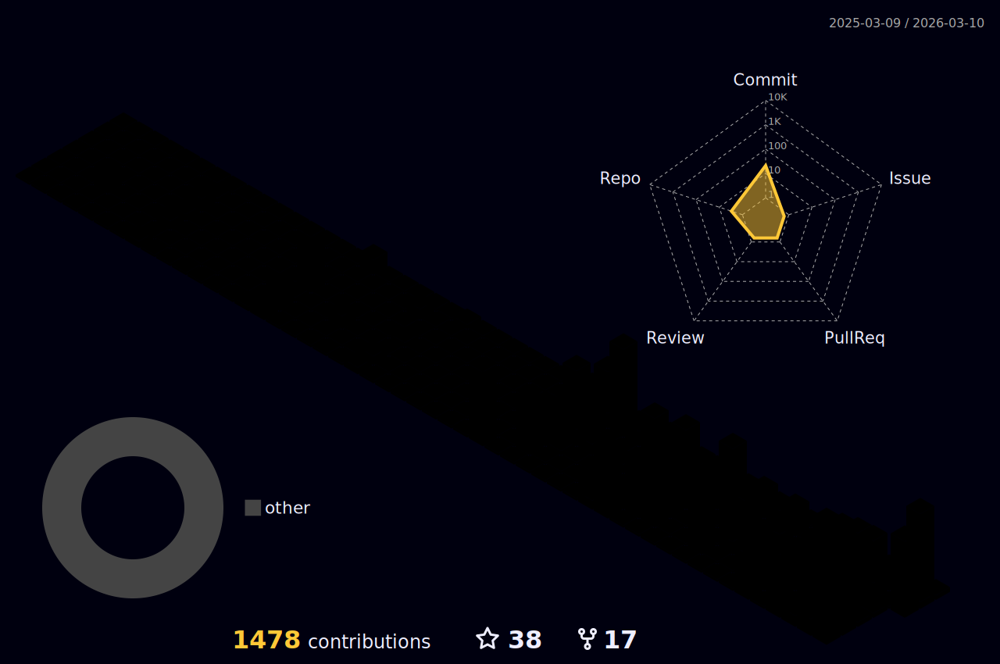

<div align="center">


<br/>

[](https://git.io/typing-svg)

<br/>

[](https://linkedin.com/in/osw4l)
[](mailto:ioswxd@gmail.com)
[](https://github.com/osw4l)
[](https://github.com/osw4l)

</div>

---


### 👨‍💻 About Me

```python
class OswaldoRodriguez:
  role       = "Senior Backend Engineer & Tech Lead"
  location   = "Barcelona, Spain 🇪🇸"
  experience = "11+ years"
  current    = "FlickFlow @ Capytop (Director of Eng)"
  stack      = ["Python","Go","FastAPI","Django",
                "LangChain","LangGraph","RAG","AWS","GCP"]
  clients    = ["EPAM×SLB","Globant×Everfi",
                "Stocktwits","Rappi","Code & Theory"]
  open_to    = "Remote Senior/Staff Backend · AI Eng"
```

<br clear="right"/>

---

## 🛠️ Tech Stack

**Languages**

<div align="left">
  
  &nbsp;
  
  &nbsp;
  
  &nbsp;
  
</div>

<br/>

**Backend Frameworks**

<div align="left">
  
  &nbsp;
  
  &nbsp;
  
</div>

<br/>

**Databases**

<div align="left">
  
  &nbsp;
  
  &nbsp;
  
  &nbsp;
  
  &nbsp;
  
</div>

<br/>

**Cloud & DevOps**

<div align="left">
  
  &nbsp;
  
  &nbsp;
  
  &nbsp;
  
  &nbsp;
  
</div>

<br/>

**AI / Agentic Stack**


---

## 📊 GitHub Stats

<div align="center">


&nbsp;&nbsp;


</div>

---

## 🏆 Trophies

<div align="center">
  
</div>

---

## 📈 3D Contribution Graph

<div align="center">
  
</div>

<details>
<summary>⚙️ How to enable the 3D graph — click to expand</summary>

Create `.github/workflows/profile-3d.yml` in this repo:

```yaml
name: GitHub-Profile-3D-Contrib
on:
  schedule:
    - cron: "0 18 * * *"
  workflow_dispatch:
  push:
    branches: [main]
jobs:
  build:
    runs-on: ubuntu-latest
    steps:
      - uses: actions/checkout@v3
      - uses: yoshi389111/github-profile-3d-contrib@0.7.1
        env:
          GITHUB_TOKEN: ${{ secrets.GITHUB_TOKEN }}
          USERNAME: ${{ github.repository_owner }}
      - run: |
          git config user.email "action@github.com"
          git config user.name "GitHub Action"
          git add -A .
          git commit -m "generate 3d contrib" || exit 0
          git push
```

Then go to **Actions → GitHub-Profile-3D-Contrib → Run workflow** to generate it the first time.

</details>

---

## 📌 Featured Projects

<div align="center">

[](https://github.com/osw4l/django-docker-full)
&nbsp;
[](https://github.com/osw4l/real-state-api)

[](https://github.com/osw4l/beer-tap-dispenser-api)
&nbsp;
[](https://github.com/osw4l/django-tickets-api)

</div>

---

## 💼 Experience Timeline

```text
2025 → Now   🏢 Capytop LLC         Director of Engineering — FlickFlow (TradingLab)
             🏢 Capytop LLC         Tech Lead — The Machine (Code and Theory) ✅

2023 → 2025  🏢 EPAM Systems        Senior Backend Developer — SLB / Schlumberger
2023         🏢 Stocktwits          Senior Backend Developer — Content Moderation

2021 → 2022  🏢 Globant             Senior Backend Developer — Everfi / E-Learning
2021         🏢 Rappi S.A.S.        Golang Backend Developer — Super App Latam

2020 → 2021  🏢 Petsology S.A.S.    Senior Backend Developer — Pet E-commerce
2019 → 2020  🏢 Wogo S.A.S.         Tech Lead — B2C Marketplace
2018 → 2019  🏢 Santa Clara Tech    Senior Backend Developer
2015 → 2018  🏢 AT Agencia / Nexu   Full Stack & Tech Lead
2014 → 2015  🏢 Kaumer Dealer       Backend Developer
```

---

<div align="center">

**📫 Let's connect**

[](https://linkedin.com/in/osw4l)
[](mailto:ioswxd@gmail.com)
[](https://wa.me/34613891480)

🎹 *Also a piano player*


</div>
